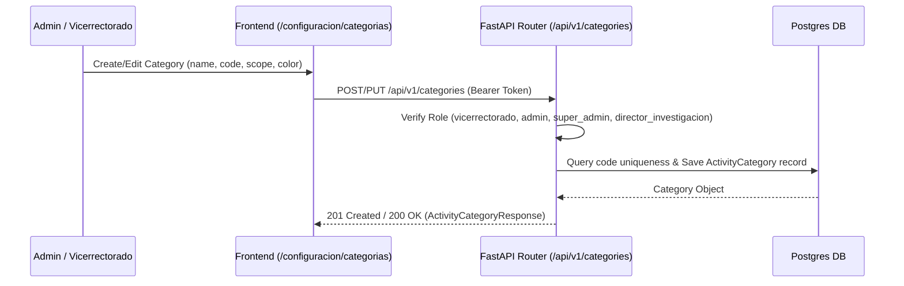

# Technical Design: Dynamic Activity Categories

## Technical Approach
Implement dynamic category management via a new `ActivityCategory` model in PostgreSQL, exposing CRUD endpoints at `/api/v1/categories/` protected by role checks (`vicerrectorado`, `admin`, `super_admin`, `director_investigacion`). Extend `AcademicActivity` and `ScientificActivity` models with optional `category_id` foreign keys while preserving legacy `category` strings and `ScientificActivityType` enums for total backward compatibility. Update Excel import logic to resolve dynamic categories by name or code and add a dedicated frontend administration view at `/configuracion/categorias`.

## Architecture Decisions

### Decision 1: Dual Foreign Key with Legacy Fallback
**Choice**: Add `category_id` (FK -> `activity_categories.id`, `nullable=True`) on both `academic_activities` and `scientific_activities`, while keeping legacy string/enum columns intact.  
**Alternatives considered**: Drop legacy columns immediately; or create separate category tables per activity type.  
**Rationale**: Avoids breaking existing database records or dependent analytics, enabling smooth zero-downtime migration and full backward compatibility.

### Decision 2: Soft Deletion (`is_active`) and Scope Scoping
**Choice**: Use `is_active` boolean for soft deletion and a string/enum `scope` column (`'academic'`, `'scientific'`, `'both'`).  
**Alternatives considered**: Hard deletion of unused categories; separate scope tables.  
**Rationale**: Soft deletion prevents breaking historical foreign key references in past activities while hiding inactive options from creation dropdowns. Scope filtering simplifies category management into a single unified table.

### Decision 3: Category Resolution in Excel Import
**Choice**: Perform a case-insensitive in-memory lookup map by category `code` and `name` against active `ActivityCategory` records during bulk import.  
**Alternatives considered**: Require strict database IDs in Excel templates; fail imports when categories fail to match.  
**Rationale**: Users provide natural category names/codes in Excel. Natural resolution gracefully links matching categories or falls back to raw string storage without rejecting valid rows.

## Data Flow


## File Changes

| File | Action | Description |
| --- | --- | --- |
| `backend/app/models/models.py` | Modify | Define `ActivityCategory` model and add `category_id` FK to `AcademicActivity` & `ScientificActivity`. |
| `backend/app/schemas/schemas.py` | Modify | Add `ActivityCategory` Pydantic schemas; update activity create/response schemas with `category_id`. |
| `backend/app/api/v1/categories.py` | Create | CRUD endpoints for category administration (`/api/v1/categories/`). |
| `backend/app/api/v1/api.py` | Modify | Register `categories.router` with prefix `/categories`. |
| `backend/app/api/v1/academic.py` | Modify | Include `category_id` in Academic Activity CRUD operations. |
| `backend/app/api/v1/scientific.py` | Modify | Include `category_id` in Scientific Activity CRUD operations. |
| `backend/app/api/v1/importacion.py` | Modify | Dynamic category resolution during Excel import and update Excel template references. |
| `alembic/versions/xxxx_add_activity_categories.py` | Create | Migration script to create table, add FK columns, and seed legacy values. |
| `frontend/lib/api.ts` | Modify | Add `ActivityCategory` interfaces and category API methods. |
| `frontend/app/actividades/components/ActivityModal.tsx` | Modify | Dynamic category fetching and dropdown binding based on activity scope. |
| `frontend/app/configuracion/categorias/page.tsx` | Create | Category Management UI for Vicerrectorado / Admin roles. |

## Interfaces / Contracts

```typescript
// Category Interface
export interface ActivityCategory {
  id: number;
  name: string;
  code: string;
  scope: 'academic' | 'scientific' | 'both';
  color?: string | null;
  description?: string | null;
  is_active: boolean;
}

// REST Endpoints
GET    /api/v1/categories/?scope={academic|scientific|both}&include_inactive={false}
POST   /api/v1/categories/ (Body: CategoryCreate)
PUT    /api/v1/categories/{id} (Body: CategoryUpdate)
DELETE /api/v1/categories/{id} (Soft-deletes category: set is_active=false)
```

## Testing Strategy

| Layer | What to Test | Approach |
| --- | --- | --- |
| Database | Table creation & initial seeding | Verify Alembic migration creates `activity_categories` and seeds legacy enum records. |
| Backend Unit | Category CRUD & Scope filtering | Test `/api/v1/categories/` endpoints for role authorization, unique code checks, and active filters. |
| Backend Integration | Excel Import category resolution | Test import with matching dynamic names, matching codes, and fallback to legacy category strings. |
| Frontend Component | Dynamic category selection in modal | Test `ActivityModal.tsx` populating scope-filtered categories dynamically. |

## Migration / Rollout
1. Run Alembic migration `upgrade head` to create `activity_categories` table and populate default categories (`GENERAL`, `CONGRESO`, `WEBINAR`, etc.).
2. Deploy backend service with `/api/v1/categories/` router and updated import logic.
3. Deploy frontend update containing `/configuracion/categorias` route and updated `ActivityModal.tsx`.
4. Verification: Test creating new categories as Vicerrectorado and assigning them in activity modals.

## Open Questions
*None — requirements and fallback strategies are fully defined.*
