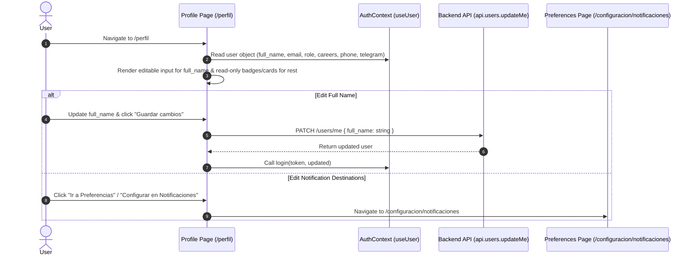

# Technical Design: Read-Only Contact Info in Profile and Centralized Destination Editing

## Technical Approach
Refactor `frontend/app/perfil/page.tsx` to eliminate duplicate editing of contact channels on the Profile page. `full_name` becomes the sole editable form field, calling `api.users.updateMe({ full_name })` upon submission. Contact destinations (`email`, `phone_number`, `telegram_chat_id`) and system identity metadata (`role`, `careers`) will be presented as read-only visual cards and badges with robust fallbacks for null or unassigned values ("Sin carrera asignada", "No configurado"). Navigation CTAs and the Telegram onboarding guide on `/perfil` will direct users to `/configuracion/notificaciones` for managing notification delivery channels.

## Architecture Decisions

### Decision: Single Editable Field (`full_name`) in Profile Form
**Choice**: Restrict `/perfil` editable form state exclusively to `full_name`.
**Alternatives considered**: Maintaining inline editable inputs for email, WhatsApp, and Telegram Chat ID on both `/perfil` and `/configuracion/notificaciones`.
**Rationale**: Dual-location editing creates data sync ambiguity and user confusion regarding which setting governs active notifications. Centralizing destination management in Notification Preferences establishes a clear single source of truth.

### Decision: Read-Only Display with Structured Cards and Badges
**Choice**: Render user system metadata (`role`, `careers`) and contact info (`email`, `phone_number`, `telegram_chat_id`) using read-only cards, info rows, and UI badges instead of disabled text inputs.
**Alternatives considered**: Using `<Input disabled />` form controls for all read-only attributes.
**Rationale**: Badges and read-only text cards clearly differentiate read-only system identity/destinations from editable inputs, improving accessibility and visual clarity.

## Data Flow



## File Changes

| File | Action | Description |
| --- | --- | --- |
| `frontend/app/perfil/page.tsx` | Modify | Refactor form state to hold only `full_name`. Render `email`, `role`, `careers`, `phone_number`, and `telegram_chat_id` as read-only badges/cards with fallbacks. Update CTAs and Telegram onboarding guide to point to `/configuracion/notificaciones`. |

## Interfaces / Contracts

### Client API Invocation (`/perfil`)
- **Endpoint**: `PATCH /api/v1/users/me` (`api.users.updateMe`)
- **Request Payload**:
  ```typescript
  {
    full_name: string | null;
  }
  ```
- **Response**: `User` (updated profile object)

### User Object Schema (`AuthContext`)
- `full_name`: `string | null`
- `email`: `string`
- `role`: `string`
- `careers`: `{ id: number; name: string }[]`
- `phone_number`: `string | null`
- `telegram_chat_id`: `string | null`

## Testing Strategy

| Layer | What to Test | Approach |
| --- | --- | --- |
| Frontend Component | `full_name` form submit | Verify editing `full_name` sends expected payload (`{ full_name }`) to `api.users.updateMe` and refreshes `AuthContext`. |
| Frontend Component | Read-only render & fallbacks | Verify `email`, `role`, `careers`, `phone_number`, and `telegram_chat_id` display as read-only cards/badges. Test fallbacks "Sin carrera asignada" and "No configurado" when values are null/empty. |
| Navigation | Redirection CTAs | Verify clicking "Ir a Preferencias" and Telegram setup CTA routes to `/configuracion/notificaciones`. |

## Migration / Rollout
- No database migrations, backend endpoint changes, or configuration updates required.
- Pure frontend component refactoring deployed in standard frontend build pipeline.

## Open Questions
- None.
