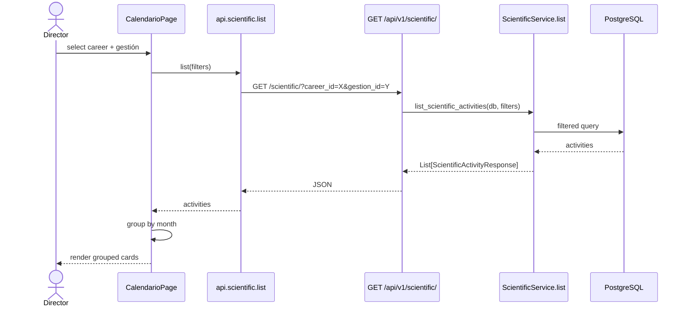
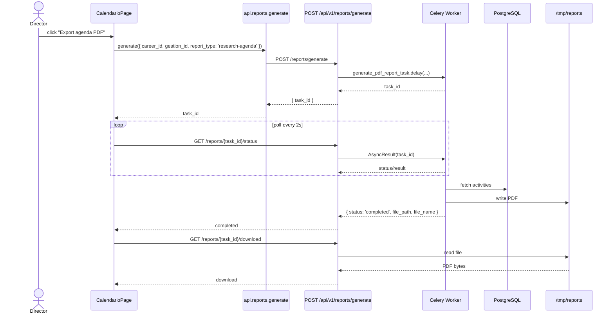

# Design: Career Research Agenda

## Technical Approach

Add optional filters to `GET /api/v1/scientific/`; replace the `/calendario` placeholder with a month-grouped card agenda; add a `research-agenda` PDF template while keeping the existing table report; add `pytest` to `backend/pyproject.toml` and quarantine stale tests. No new entities or DB migrations.

## Architecture Decisions

| Decision | Choice | Rationale |
|---|---|---|
| Filter placement | Extend `GET /api/v1/scientific/` | No schema change; preserves existing clients |
| Month grouping | Frontend groups by `start_date` month | Keeps the API generic and reusable |
| PDF template | Add `research-agenda` selected by `report_type` | Existing table report untouched |
| Celery task | Extend `generate_pdf_report_task(career_id, gestion_id, report_type)` | Shares DB/session code; default stays table |
| Frontend state | Local `useState`/`useEffect` | Matches the existing project (no global store) |
| Service layer | New `app/services/scientific_service.py` | Thin router, testable service without refactoring all routers |

## Data Flow

### Filtered Agenda Fetch



### Async PDF Generation + Polling



## File Changes

| File | Action | Description |
|---|---|---|
| `backend/app/services/scientific_service.py` | Create | Filtered query builder |
| `backend/app/api/v1/scientific.py` | Modify | Accept query params; call service |
| `backend/app/schemas/schemas.py` | Modify | Filter params model |
| `backend/app/workers/reports_worker.py` | Modify | Branch by `report_type` |
| `backend/app/api/v1/reports.py` | Modify | Accept `report_type` in request |
| `frontend/app/calendario/page.tsx` | Modify | Container page |
| `frontend/lib/api.ts` | Modify | API helpers |
| `frontend/components/agenda/AgendaFilterBar.tsx` | Create | Selectors |
| `frontend/components/agenda/AgendaNoCareerSelected.tsx` | Create | Prompt state when no career selected |
| `frontend/components/agenda/AgendaMonthGroup.tsx` | Create | Month group |
| `frontend/components/agenda/AgendaActivityCard.tsx` | Create | Activity card |
| `frontend/components/agenda/AgendaSkeleton.tsx` | Create | Loading state |
| `frontend/components/agenda/AgendaEmptyState.tsx` | Create | Empty state |
| `frontend/components/agenda/AgendaErrorState.tsx` | Create | Error + retry |
| `backend/pyproject.toml` | Modify | `pytest`; `httpx` required by FastAPI `TestClient` for the test-infrastructure repair |
| `backend/tests/test_api.py` | Modify | Quarantine stale tests (import-safe) |
| `backend/tests/conftest.py` | Create | SQLite `get_db` override |

## Frontend State & Data Flow

`CalendarioPage` holds `careerId`, `gestionId`, `activities`, `isLoading`, `error`, and `exporting`. A `useEffect` refetches `api.scientific.list` only when `careerId` is selected (`gestionId` is optional); `useMemo` groups results by month. While `careerId` is null, the page renders `AgendaNoCareerSelected` with a prompt to select a career. `AgendaFilterBar`, `AgendaNoCareerSelected`, `AgendaMonthGroup`, `AgendaActivityCard`, `AgendaSkeleton`, `AgendaEmptyState`, and `AgendaErrorState` are presentational. Selectors load options from `api.careers.list` and `api.gestiones.list`.

## Interfaces / Contracts

### Query Parameters

`GET /api/v1/scientific/?career_id={int}&gestion_id={int}&start_date={YYYY-MM-DD}&end_date={YYYY-MM-DD}`

- All optional; `career_id`/`gestion_id` integers `>=1`; dates ISO 8601.
- Malformed dates and `start_date > end_date` are validated by FastAPI on the router query parameters, returning 422 before the service is invoked; the service does not duplicate the check.
- Overlap: `scientific_activities.start_date <= end_date AND scientific_activities.end_date >= start_date`.

### Filter Service

```python
def list_scientific_activities(
    db, career_id=None, gestion_id=None, start_date=None, end_date=None, skip=0, limit=100
) -> list[ScientificActivity]: ...
```

### Report Request

```python
class ReportRequest(BaseModel):
    career_id: int
    gestion_id: int
    format: str
    report_type: str = "table"   # or "research-agenda"
```

### PDF Template

`build_research_agenda_pdf(doc, activities, career_name, gestion_name)` renders:

- Header: career name, gestión name, generation date.
- Month sections.
- Per activity: title, type badge, responsible, date range, status, notes.

It differs from the existing table report by replacing the two academic/scientific tables with a branded, month-grouped agenda.

### Frontend API Helpers

```ts
api.scientific.list({ career_id?, gestion_id?, start_date?, end_date? })
api.reports.generate({ career_id, gestion_id, format: 'pdf', report_type: 'research-agenda' })
api.reports.status(taskId)
api.reports.download(taskId)
```

Response schema remains `ScientificActivityResponse`.

## Testing Strategy

| Layer | What | Approach |
|---|---|---|
| Unit | `ScientificService.list_scientific_activities` | SQLite session |
| Integration | `GET /api/v1/scientific/?...` | `TestClient` with `get_db` override |
| Worker | PDF smoke | Assert PDF contains career and month |
| Frontend | UI states | Manual review (no test runner) |

### Stale Tests

All eight stale tests in `backend/tests/test_api.py` are quarantined. Because the module-level imports `from app.models.auth import User` and `from app.schemas.auth import Token, UserLogin` fail at collection time before any marker can run, the broken imports are moved inside the test functions that use them and each stale test is decorated with `@pytest.mark.skip(reason="quarantined stale test")`. This makes pytest collection import-safe and applies the quarantine marker.

### New Tests

No new business-logic tests are added in this change per `backend-test-infrastructure/spec.md`.  
Recommended follow-up (outside this change): add `backend/tests/test_scientific_filters.py` covering unfiltered list, career filter, gestión filter, date range, combined filters, empty result, and invalid date 422 once the test-infrastructure repair is accepted.

## Migration / Rollback

No database migration is required; filters use existing columns on `scientific_activities`. Rollback is a single revert of the commit.

## Open Questions

None.
